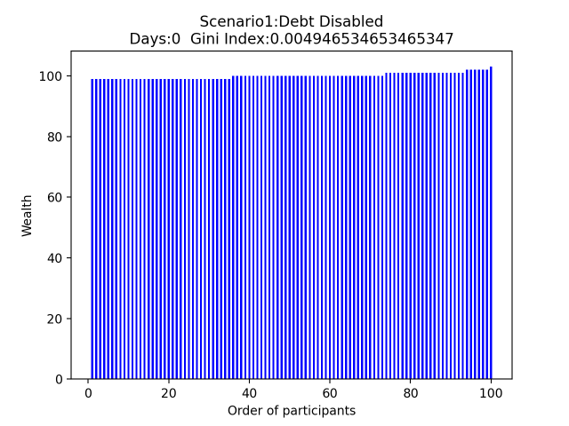

# 努力和幸运哪个更重要？以一个简单模型求解社会贫富问题

<center>王晨 PE20060014
<br>完成时间 2021年5月30日</br>
</center>
本报告不支持PDF格式，请使用支持md格式的文档编辑器打开，或者使用浏览器打开文件夹下的index.html，如文档无法正确显示GIF图，请点击该url(http://home.ustc.edu.cn/~windwang/)查看报告，或与我联系。


## 一、背景介绍:

最近“内卷”是一个非常火热的社会话题，随着社会贫富差距增大，社会竞争激烈程度加剧，许多出身普通的年轻人有的相信靠自己的努力能够“卷出”一片天地，也有的看不到希望干脆选择“躺平”。“努力”真的会改变命运吗？我们有多大可能“逆袭”生而不凡的幸运“富二代”呢？社会均贫富到底有多难？这是一个社会学问题，也是一个统计学问题，出于对这个问题的好奇，我以一个简单模型为例进行求解，试图找到一定的答案。


## 二、实验题目:

我们不妨用一个简单模型来模拟社会财富的分配或者变化的规律：

假设共有100个人，每人在初始时有100元的财富，在22岁（大学毕业）时进入社会，每天都会经历一次财富分配（这可以理解为日常消费以及收入），分配方式为每人每天都在这100个人中随机地选择一人发一块钱（可以选择自己），直到65岁（退休）时结束。

请问最后大家所持有的财富分布是怎样的？

对于那些富人，是否可以通过征税的方式使得财富分布更加平均呢？

如果有人非常努力，因此有更大的机会被选中获得一块钱，他最终是否能逆袭初始财富就大于100元的富二代呢？


## 三、实验目的:

本次实验我将首先通过python编程模拟，针对不同的变种情况，对此问题进行求解，并回答在65岁时，这100个人的财富分布会是怎样的。然后，我将尝试回答我最好奇的问题，如果有人非常努力，有更大的机会被选中获得财富，他最终是否能逆袭初始财富就大于100元的富二代呢？

最后，我将尝试通过数学方法求解其理论分布（这可能完不成）。


## 四、实验环境:

实验系统：MacOS BigSur 11.2.3

实验IDE及编程语言：pycharm+anaconda+python3.8 

实验依赖的库文件：

```python
import os
import math
import numpy as np
import random
import matplotlib.pyplot as plt
import imageio
import cv2
```


## 五、实验设计：

在实验开始之前，我们需要了解一些预备知识。

#### 1. 基尼系数<sup>[1]</sup>：**基尼系数**是指国际上通用的、用以衡量一个国家或地区居民收入差距的常用指标。

基尼系数最大为“1”，最小等于“0”。基尼系数越接近0表明收入分配越是趋向平等。国际惯例把0.2以下视为收入绝对平均，0.2-0.3视为收入比较平均；0.3-0.4视为收入相对合理；0.4-0.5视为收入差距较大，当基尼系数达到0.5以上时，则表示收入悬殊。它的计算示意图如下：


对应图中基尼系数的计算公式就是：Gini Index=Sa/(Sa+Sb)。对于本实验的基尼系数，其计算方法如下，
$$
G=1- \frac{\int_{0}^{100}{dy}\int_{0}^{x}-ln(1-x/100)dx}{100*100/2}
$$
代码如下：

```python
# 计算基尼系数
# initial_money = people = 100
def gini(initial_money, people, wealth):
    cumul = 0
    ave = np.mean(wealth)
    #print(ave)
    max = ave * people * (people + 1) / 2
    for i in range(people):
        cumul += (people - i) * (ave - wealth[i])
    gini_index = cumul / max
    return gini_index
```

为什么要引入这个指数呢？第一，这个系数可以直观地表征财富分布的差距，按照定义，初始时如果大家的财富都是100元，那么基尼系数应该是0。第二，我们可以通过基尼系数的变化来判断当前社会财富分布是否已经达到稳定了，因为本实验是从22岁模拟到65岁，共15000多轮，那么如果在15000轮左右，基尼系数趋于稳定值，那么我们可以推断当前的实验结果是基本可靠的。


#### 2. 实验前的初步设想

本实验算法并不困难，只需要在每一轮时遍历每个人的财富，以不可负债的情况为例，判断每个人的财富是否大于1，如果是，则随机选择另外99人中的一人，使其财富加一即可。这道题的关键在于求解最后的分布是怎样的，有没有一种数学方法可以求解其理论分布呢？

如果换一个角度考虑这个问题，由于每个人获得钱的机会都是独立的，那么我们可以先将每个人的钱都扣去一块（允许负债的话），然后这100元都以1%的概率落在每个人的头上。那么这样做n次的独立实验，也就是每次有0.01的概率拿到一块钱，最后再扣掉n块钱，就是n轮后这个人的财富值。那么不难发现，这应该是一个二项分布<sup>[2]</sup>问题，由于我们迭代的次数n很大，根据中心极限定理<sup>[3]</sup>，我初步猜测，这样的分布最后应该是一个正态分布<sup>[3]</sup>。也就是一个类似于这样的分布：


但出乎我意料的是，这个猜测是完全错误的。


## 实验结果:

*注1:本实验完整代码请查看源文件，运行前请先修改相应的保存地址，如果无法运行请与我联系。*

*注2：由于本实验采用的随机数生成函数为random.choice，遵循其相应的概率密度函数，因此如果在不同的计算机上，甚至在同一计算机不同时间运行，由于生成的伪随机数不同，或者随机数生成函数的不同，最后得到不同的分布图像，这是正常的，但大致的统计规律应该是一致的*

### 1.不可负债的情况

对于不可负债的情况，每个人的初始财富均为100，如果运行到有人的财富为0时就停止，得到的结果如下：


如果运行到有人的财富为0时就停止，那么基本上到1800天左右时就会有人破产，游戏结束，这样没什么意思。因此，在不可负债的情况下，如果有人破产，那么这个人的下一轮不需要给钱，但仍可以获得钱，这样模拟15600轮，也就是到他们65岁时的结果如下：


代码如下：

```python
#S1:不允许负债的情况
def generate1(days):
    import random
    wealth = []
    order = []
    for i in range(100):    #定义100个人的序号
        order.append(i+1)
    for i in range(100):    #定义初始财富
        wealth.append(100)
    for j in range(days):   #模拟22-65岁 共15695天
        for i in range(100):    #模拟每天100个人的财富交换
            if wealth[i]==0:    #不可负债
                #break          #如果有人财富为0了 就停止游戏
                continue        #财富为0时，不支出，游戏继续
            else:
                wealth[i] = wealth[i] - 1
                #rand_guy=random.choice([x for x in range(0,100) if x!=i ])  #100平均分布取出一个人，不可选择自己
                rand_guy=random.choice([x for x in range(0,100) ])  #100平均分布取出一个人
                wealth[rand_guy] = wealth[rand_guy] + 1
        wealth.sort()#对财富排序
        # 检验财富有无流失，return 10000则没有流失
        # print(sum(wealth))
        gini_index = gini(100, 100, wealth)  # 计算基尼系数
        #print(gini_index)
        # 显示100个人的财富柱状图
        #fig1 = plt.figure()
        if ( j % 200 == 0):
            plt.bar(order,wealth,0.5,color="blue")
            plt.title('Scenario1:Debt Disabled\nDays:' + str(j) + '  Gini Index:' + str(gini_index))
            plt.xlabel('Order of participants')
            plt.ylabel('Wealth')
            #plt.legend()
            plt.draw()
            plt.pause(0.00001)
            plt.savefig('../pythonProject/Scenario1/'+j//200*str(1)+'.png')
            if(j!=days):            #保留最运行结束时的数据
                plt.close()
    gif_name = 'Scenario1.gif'
    pic_path = '../pythonProject/Scenario1/'  # 指定文件路径
    duration = 0.1
    create_gif(gif_name, pic_path, duration)
    return wealth, order
```


### 2.允许负债

如果允许负债，这也符合社会的真实情况，财富的分布应该就是情况1的分布拓展到负数：


代码如下：

```python
#S2:允许负债的情况
def generate2(days):
    wealth = []
    order = []
    for i in range(100):
        order.append(i+1)
    for i in range(100):
        wealth.append(100)
    for j in range(days):		#可负债情况不需判断某人的金钱是否为0
        for i in range(100):
            wealth[i]=wealth[i]-1
            #rand_guy=random.choice([x for x in range(0,100) if x!=i ])  #100平均分布取出一个人，不可选择自己
            rand_guy=random.choice([x for x in range(0,100) ])
            wealth[rand_guy]=wealth[rand_guy]+1
        wealth.sort()
        gini_index = gini(100, 100, wealth)  # 计算基尼系数
    # 显示100个人的财富柱状图
    # fig1 = plt.figure()
        if ( j % 200 == 0):
            plt.bar(order,wealth,0.5,color="blue")
            plt.title('Scenario2:Debt Enabled\nDays:' + str(j) + '  Gini Index:' + str(gini_index))
            plt.xlabel('Order of participants')
            plt.ylabel('Wealth')
            #plt.legend()
            plt.draw()
            plt.pause(0.00001)
            plt.savefig('../pythonProject/Scenario2/'+j//200*str(1)+'.png')
            if(j!=days):            #保留最运行结束时的数据
                plt.close()
    gif_name = 'Scenario2.gif'
    pic_path = '../pythonProject/Scenario2/'  # 指定文件路径
    duration = 0.1
    create_gif(gif_name, pic_path, duration)
    return wealth, orde
```


### 3.允许负债和对富人征收所得税

对资产大于200的人，当其每天获得收入时，需要缴纳20%的所得税，并将其分配给最穷的2个人：


对资产大于200的人，当其每天获得收入时，需要缴纳40%的所得税，并将其分配给最穷的4个人：


代码如下：

```python
#S3:对富人收税的情况：
def generate3(days):
    import random
    wealth = []
    order = []
    for i in range(100):
        order.append(i+1)
    for i in range(100):
        wealth.append(100.0)
    for j in range(days):
        for i in range(100):
            wealth[i]=wealth[i]-1
            #rand_guy=random.choice([x for x in range(0,100) if x!=i ])  #100平均分布取出一个人，不可选择自己
            rand_guy=random.choice([x for x in range(0,100) ])
            if wealth[rand_guy]>=200.0:#对拥有大于200元的玩家征收20%的税
                wealth[rand_guy] = wealth[rand_guy] + 0.8
                wealth_transi = wealth[:]
                for m in range(2):#对最贫穷的2位玩家每人补贴0.1元
                    ind=wealth_transi.index(min(wealth_transi))
                    wealth[ind]=wealth[ind]+0.1
                    wealth_transi[ind]=100000000
            else:
                wealth[rand_guy] = wealth[rand_guy] + 1
        wealth.sort()
        gini_index = gini(100, 100, wealth)  # 计算基尼系数
        # 显示100个人的财富柱状图
        # fig1 = plt.figure()
        if (j % 200 == 0):
            plt.bar(order,wealth,0.5,color="blue")
            plt.title('Scenario3:Debt and 20%TAX Enabled \nDays:' + str(j) + '  Gini Index:' + str(gini_index))
            plt.xlabel('Order of participants')
            plt.ylabel('Wealth')
            #plt.legend()
            plt.draw()
            plt.pause(0.00001)
            plt.savefig('../pythonProject/Scenario3/' + j // 200 * str(1) + '.png')
            if(j!=days):            #保留最运行结束时的数据
                plt.close()
    gif_name = 'Scenario3.gif'
    pic_path = '../pythonProject/Scenario3/'  # 指定文件路径
    duration = 0.1
    create_gif(gif_name, pic_path, duration)
    return wealth, order
```


### 4.富二代出现

我选取了10位标记为红色的幸运儿，让其初始时就带有200元的财富：


模拟15600轮，也就是到他们65岁时：


如果初始就带有4倍于其他同龄人的财富呢？


代码如下：

```python
#S4：富二代出现
def generate4(days):
    wealth = []
    order = []
    for i in range(100):
        order.append(i+1)
    for i in range(10):#前10位玩家是富二代，生来就比普通玩家多2倍财富
        wealth.append(200.0)
    for i in range(10,100):
        wealth.append(100.0)
    for j in range(days):#模拟15695轮财富分配
        for i in range(100):
            wealth[i]=wealth[i]-1
            #rand_guy=random.choice([x for x in range(0,100) if x!=i ])  #100平均分布取出一个人，不可选择自己
            rand_guy=random.choice([x for x in range(0,100) ])
            wealth[rand_guy]=wealth[rand_guy]+1
        # 排序
        wealth_transi = wealth[:]
        wealth_sort = []
        order_rich = []
        wealth_rich = []
        order_normal = []
        wealth_normal = []
        for i in range(100):
            ind_min = wealth_transi.index(min(wealth_transi))
            wealth_sort.append(min(wealth_transi))
            wealth_transi[ind_min] = float('inf')
            if ind_min in [0, 1, 2, 3, 4, 5, 6, 7, 8, 9]:
                order_rich.append(len(wealth_sort) - 1)
                wealth_rich.append(wealth_sort[-1])
            else:
                order_normal.append(len(wealth_sort) - 1)
                wealth_normal.append(wealth_sort[-1])
        gini_index = gini(100, 100, wealth_sort)  # 计算基尼系数
        print(gini_index)
        # barchart
        # fig1 = plt.figure()
        if (j % 200 == 0):
            plt.bar(order_rich, wealth_rich, 0.5, color="red")
            plt.bar(order_normal, wealth_normal, 0.5, color="blue")
            plt.title('Scenario4:Born Rich with 200\nDays:' + str(j) + '  Gini Index:' + str(gini_index))
            plt.xlabel('Order of participants')
            plt.ylabel('Wealth')
            plt.legend()
            plt.draw()
            plt.pause(0.00001)
            plt.savefig('../pythonProject/Scenario4/' + j // 200 * str(1) + '.png')
            if (j != days):  # 保留最运行结束时的数据
                plt.close()
        # plt.show()
    gif_name = 'Scenario4.gif'
    pic_path = '../pythonProject/Scenario4/'  # 指定文件路径
    duration = 0.1
    create_gif(gif_name, pic_path, duration)
    return wealth, order
```


### 5.努力可以改变命运吗？和富二代比呢？

我将前十位标记成绿色的玩家作为了奋斗者，他们家境清寒，初始财富只有50，但他们非常努力，每天可以比其他人多万分之一的几率赚到钱，同样的，红色的富二代在初始时就带有200元的财富。


模拟15600轮的结果：


代码如下：

```python
#S5更努力有用吗？
def generate5(days):
    wealth = []
    order = []
    for i in range(100):
        order.append(i+1)
    for i in range(10):
        wealth.append(50)
    for i in range(10,90):
        wealth.append(100)
    for i in range(90,100):
        wealth.append(200)      #后10名为初始携带200元的富二代
    for j in range(days):
        for i in range(100):
            wealth[i]=wealth[i]-1
            rand_guylist1=[x for x in range(0,10) if x!=i]#定义0到9号玩家序号
            rand_guylist2 = [x for x in range(10, 100) if x != i]#定义10到99号玩家序号
            ind=random.randint(0,1000)
            # 前10位玩家得到钱的概率要微大于后90位玩家，几率大了将近万分之一，以此模拟10位更努力的玩家
            if ind<=100:#在0到9号玩家中取一个人的概率是11/1000
                rand_guy = random.choice(rand_guylist1)
            else:#在10到99号玩家中取一个人的概率是（1000-11）/1000
                rand_guy = random.choice(rand_guylist2)
            wealth[rand_guy]=wealth[rand_guy]+1
    #wealth.sort()
        # 排序
        wealth_transi = wealth[:]
        wealth_sort = []
        order_rich = []
        wealth_rich = []
        order_hard = []
        wealth_hard = []
        order_normal = []
        wealth_normal = []
        for i in range(100):
            ind_min = wealth_transi.index(min(wealth_transi))
            wealth_sort.append(min(wealth_transi))
            wealth_transi[ind_min] = float('inf')
            if ind_min in [0, 1, 2, 3, 4, 5, 6, 7, 8, 9]:
                order_hard.append(len(wealth_sort) - 1)
                wealth_hard.append(wealth_sort[-1])
            elif ind_min in [90, 91, 92, 93, 94, 95, 96, 97, 98, 99]:
                order_rich.append(len(wealth_sort) - 1)
                wealth_rich.append(wealth_sort[-1])
            else:
                order_normal.append(len(wealth_sort) - 1)
                wealth_normal.append(wealth_sort[-1])    #print(len(order_hard)==len(order_hard),len(order_rich)==len(wealth_rich),len(order_normal)==len(wealth_normal))
        gini_index = gini(100, 100, wealth_sort)  # 计算基尼系数
        # barchart
        # fig1 = plt.figure()
        if (j%200==0):
            plt.bar(order_rich, wealth_rich, 0.5, color="red")
            plt.bar(order_hard, wealth_hard, 0.5, color="green")
            plt.bar(order_normal, wealth_normal, 0.5, color="blue")
            plt.title('Scenario5:Hard-working by 0.01% VS Born Rich 200%\nDays:' + str(j) + '  Gini Index:' + str(gini_index))
            plt.xlabel('Order of participants')
            plt.ylabel('Wealth')
            plt.legend()
            plt.draw()
            plt.pause(0.00001)
            plt.savefig('../pythonProject/Scenario5/' + j // 200 * str(1) + '.png')
            if (j != days):  # 保留最运行结束时的数据
                plt.close()
            # plt.show()
    gif_name = 'Scenario5.gif'
    pic_path = '../pythonProject/Scenario5/'  # 指定文件路径
    duration = 0.1
    create_gif(gif_name, pic_path, duration)
    return wealth, order
```


## 六、实验得到的结论:

### 1.对于第一种不可负债的情况：

如果运行到有人的财富为0时就停止，那么基本上运行到1800天的时候就会结束，此时观察到的财富分布基本符合正态分布，基尼系数大约稳定在0.21左右。如果我们提供了保护机制：破产的人下一轮可以不付钱，但仍有获得金钱的机会，得到的结果却出乎我的意料，基尼系数越来越大了！由于基尼系数在15000轮完成后仍然有增大的趋势，我又模拟了35000轮，最后的基尼系数基本稳定在4.5上下：



这样的结果是出乎我的意料的，看似对弱者有利的保护机制，反而使得社会的贫富差距更大了！最富有的20%的人掌握了超过一大半的财富，财富分配变成了指数型，而基尼系数0.45意味着财富差距较大！

因此，这样的结果告诉我们，即使在一个机会均等的社会，最后大家的财富差距也会是巨大的。而且如果仅仅是靠给破产的不用支出的机会，实际上是无法改善社会贫富差距的。


### 2.可以负债的情况：

如果允许负债，这是符合社会的真实情况的，那么猜测财富的分布应该是情况1的分布拓展到负数，结果也确实是这样。同时我们可以看到，如果允许负债，贫富差距会比不允许负债的情况更大！基尼系数甚至稳定在了0.67左右，而基尼系数大于0.5就已经达标贫富差距悬殊了，这是非常可怕的贫富差距。正常的稳定社会是不会存在这样的贫富差距的。


### 3.允许负债和对富人征收所得税

从2的结论我们可以看到，正常社会都必须对贫富差距的调控采取措施，最常见的就是收税了。我对财富大于200的富人进行了征税，如果征收20%的所得税分给最穷的两个人，从结果上可以看到，负债的穷人明显地减少了，在他们65岁退休时，几乎没有人是负资产。同时，基尼系数也较第二种情况大大减小了，基本在0.35左右，这是相对合理的贫富差距。因此我们可以得出结论，收税可以改善贫富差距。

我又模拟了40%的重税，仍然是分给最穷的两个人，但最后的基尼系数也基本稳定在0.35上下。我又模拟了征收50%所得税并分给5个最穷的人的情况，最后的基尼系数也基本没有改变：


这个结果是很有趣的，征税的确可以减小贫富差距，但是它却有边际效应，也就是到了一定程度后，即使进一步增大税率，也无法继续减小贫富差距了。这让我又产生了另一个猜测，之前对富人的定义是财富大于200，如果定义的富人为大于150呢？情况是否会有变化？


结论是有变化，并且贫富差距进一步减小了，此时的基尼系数小于0.2，已经基本属于收入绝对平均社会了，现实中绝大部分国家都达不到这样的水平。因此，对富人的定义决定了富人可以处于什么样的水平，这也解释了，为什么北欧国家的贫富差距较小，因为这些国家是全民重税，带来了高福利，低贫富差距的效果。但是这样的结论在现实中仍然是局限的，因为真正的富人会想尽办法避税，否则他们最终就会和普通人的财富上没有什么太大差距。


### 4.富二代出现

上一代的财富，如果能够积累到下一代，这样的继承相对普通人来说，优势是巨大的。从五.4的结果中可以看到，有富二代的社会，即使机会均等，最后的贫富差距仍然是巨大的。富二代虽然确实会有家道中落的情况（只有一人），但是在人生的前期阶段，他们还是长时间地占据了最有钱的那部分人，即使到了最后，他们之中的大部分人还是处于中上阶层。因此，富二代起码能够比普通人，有着更高的下限。

这还是只富二代只有2倍于普通人财富的情况，如果是4倍的财富，那起码在一代人有限的时间内，中上阶层大部分仍然由这些富二代占据，普通人已经很难超越了。而实际的情况是，富二代根本不止于普通人几倍的财富，如果是这样，普通人起码在你有限的时间内，22-65岁，是几乎不可能超越他们的，这就是阶级固化。

因此，普通人如果无法从上一代继承到大量的财产，并且又什么都不做，那么从数据上看，你跨越阶级的可能性是微乎其微的。


### 5. 努力可以改变命运吗？和富二代比呢？

对应我们现在的社会，贫富差距实际上是比较大的，真正的有钱人的财富可能超出了普通人的想象。尤其是疫情之后，经济增速放缓，由增量经济逐渐转向存量经济，其显著的特点就是因为没有外部资源的增长，导致了内卷程度加剧，这就很好地对应到了这个模型，社会总财富没有发生变化，阶级的变迁是需要将其他人踩在脚下才行。

因此我又模拟了这样的情况，10位富二代的初始财富仍然是200，普通人为100，10位小镇做题家虽然家境贫寒（初始只有普通人一半的财富），但是坚信努力改变命运，通过不断努力，他每天获得财富的几率大了万分之一（每天万分之一的增益，放在一生中的效益是非常大的）。

在此情况下，得出的结果还是非常令人振奋的，在大约7200天之后，有一位小镇做题家登顶了财富榜榜首！并且直到最后，首富都是由出身贫寒的小镇做题家保持！在一开始，这些小镇做题家处于社会的最下层，但是经过一辈子的努力，他们之中有6名（60%）达到了社会前20%的财富地位，超越了绝大多数普通人，和富二代的数量和占比是一样的，尽管富二代的下限仍然比他们高。

因此，努力还是有用的！起码如果你什么都不做，那你很可能永远都是人下人！


## 七、进一步的分析

到此为止，我还没有解决我最开始的猜测，为什么财富的分布最后呈现指数型呢？这里需要引入第二个知识点，熵。

熵增定律<sup>[5]</sup>：孤立系统如果没有外界作用，总是趋向于熵增，最终达到熵的最大状态，也就是系统的最混乱无序状态。这条定律是自然界普遍适用的，在热力学和信息论中对熵有着广泛研究应用。

对于我们的这个模型系统，财富总量不变，没有外界作用，那么应该总是趋向于熵增的，最终趋于系统熵最大状态，现在就是要尝试求解熵最大时的分布<sup>[6]</sup>。假设系统中的任意一个人的财富为m(i)的概率为p(i)，那么从一开始的分析我们就可以知道，这个人财富期望为100，这样就有两个约束条件：p1+p2+...+pi=1，p1m1+p2m2+...+pimi=100

这个人财富量的信息熵<sup>[7]</sup> S=-p1ln(p1)-p2ln(p2)-...-piln(pi)

我们引入新的参量，从而求F的极大值：
$$
F（p_i,\lambda, \mu）=-\sum_{i}(p_iln(p_i))-\lambda(\sum_i(p_i)-1)-\mu(\sum_i(mipi)-100)
$$
也就是使其梯度
$$
\nabla F(pi)=0
$$
对其求偏导
$$
\nabla F(pi)=-\sum_i(ln(p_i)+1-\lambda-\mu mi)dpi-(\sum_ipi-1)d\lambda-(\sum_im_ip_i-100)d\mu
					=-\sum_i(ln(p_i)+1-\lambda-\mu mi)dpi (后两项为0)
$$
因为dpi是任意的，所以有
$$
p_i=e^{-\lambda+1-\mu mi} （其中-\lambda+1是常数）
$$
因此pi正比于exp(-umi)，也就是说某个人拥有某财富量的概率正比于其对应指数，那么该人拥有的财富量的分布为近指数分布，也就是玻尔兹曼分布。确定了这个之后，就可以确定相应的参数画出对应的理论曲线了。

我们假设每个人拥有的财富量y和对应的概率密度p的关系为
$$
p=\lambda e^{-\mu y}
$$
然后根据期望值为100，归一化
$$
\int_{0}^{\infty}\lambda e^{-\mu y}=1,  \int_{0}^{\infty}\lambda y e^{-\mu y}=100 ,
$$
通过这两个参数确定 
$$
\lambda=\mu=\frac{1}{100}
$$
所以累积函数
$$
F(y)=\int_{0}^{y}\frac{1}{100}e^{\frac{-y}{100}}dy=1-e^{\frac{-y}{100}}
$$
从而拥有的财富量y和对应从低到高排名x满足 x =100F(y)，从而拥有函数曲线y=-100ln(1-x/100)

求出了该理论曲线的方程，其代码如下

```python
# 玻尔兹曼分布曲线
def fit1(initial_money, people, step):
    x = np.arange(0.5, 0.5 + people)
    y = np.zeros(people)
    for i in range(people):
        y[i] = -initial_money * math.log(1 - x[i] * 1.0 / people)
    x = np.reshape(x, (len(x), 1))
    y = np.reshape(y, (len(y), 1))
    fitline = np.hstack((x, y))
    return fitline
```

画到刚才的柱状图上，得到如下结果，红色线为理论分布曲线，基本符合，证明我的推导是正确的：


## 八、最后的总结和收获

经过到此为止的分析，我们已经可以得到以下结论了：

1.在总资产不变且自由流动，机会均等的情况下，人们财产的分布最终呈指数型分布，而不是平均分布或是正态分布。由于熵增定律，除非有外力作用，否则贫富差距将越来越大。

2.在总资产不变且自由流动，机会均等的情况下，完全均贫富是非常困难的，但还是有可能达到共同富裕的，比如严格限制负债和控制税收，尤其是对富人的征税。

3.财富积累的优势是可以延续的，有钱人的下一代往往也是有钱人，社会财富的积累具有马太效应。但是努力还是可以改变命运的，只是阶级的跨越往往需要几代人长时间不懈的努力。

4.对于普通人来说，如果你既没有有钱的父母，也没有努力的精神，那么从概率上来说，不出一代人，你就会成为社会的中下阶层。因此，为了自己和下一代，还是卷吧！


本模型和得到的结论还是非常粗糙的，社会真实情况要复杂得多得多，但是经过一周多的时间对这几个问题的求解，还是让我大开眼界，收获良多！因为之前没有学习过python，从0开始，也加强了不少python语言的编程能力，不得不说，python对于这类统计学科问题的求解还是非常有用的！


##  												参考资料及文献

[1].[基尼系数](https://baike.baidu.com/item/基尼系数/88365?fr=aladdin)

[2].[二项分布](https://baike.baidu.com/item/二项分布/1442377?fr=aladdin)

[3].陈希孺 (2009) 概率论与数理统计. 中国科学技术出版社

[4].John V. Guttag(2018) Python编程导论*(*第2版). 人民邮电出版社

[5].[熵增定律](https://baike.baidu.com/item/熵增定律)

[6].[幂律和最大熵是什么关系?](https://www.zhihu.com/question/26955285)

[7].姜丹 信息论与编码(第三版).中国科学技术大学出版社

[8].Lawler, G. F. . (2010). Random walk and the heat equation. *American Mathematical Society Providence Ri,* *55*, 156.

[9].[如果35岁破产，还有多大可能逆袭?](https://blog.csdn.net/weixin_34254823/article/details/85211693?utm_medium=distribute.pc_relevant.none-task-blog-baidujs_title-0&spm=1001.2101.3001.4242)

